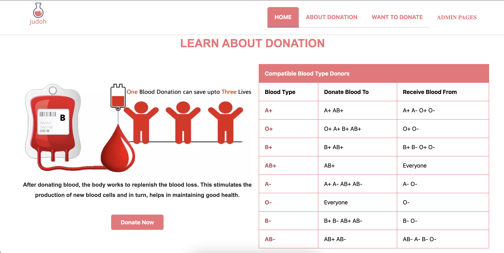
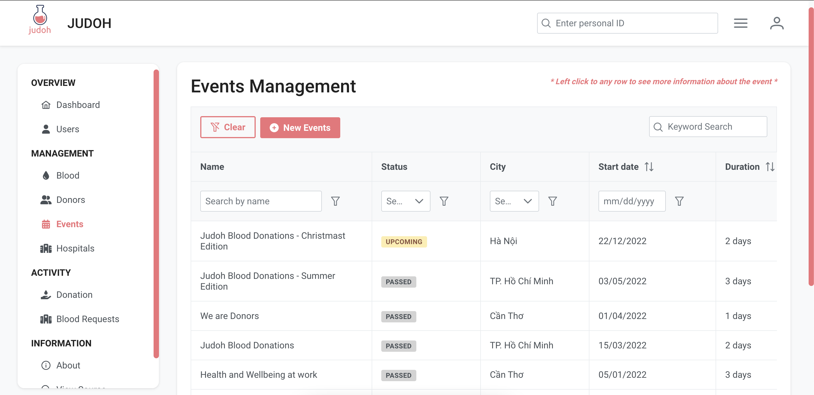
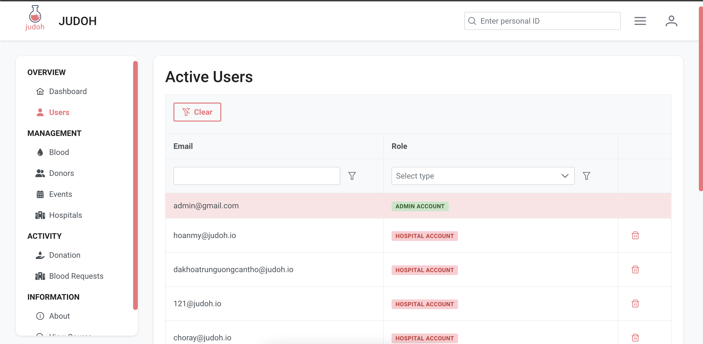
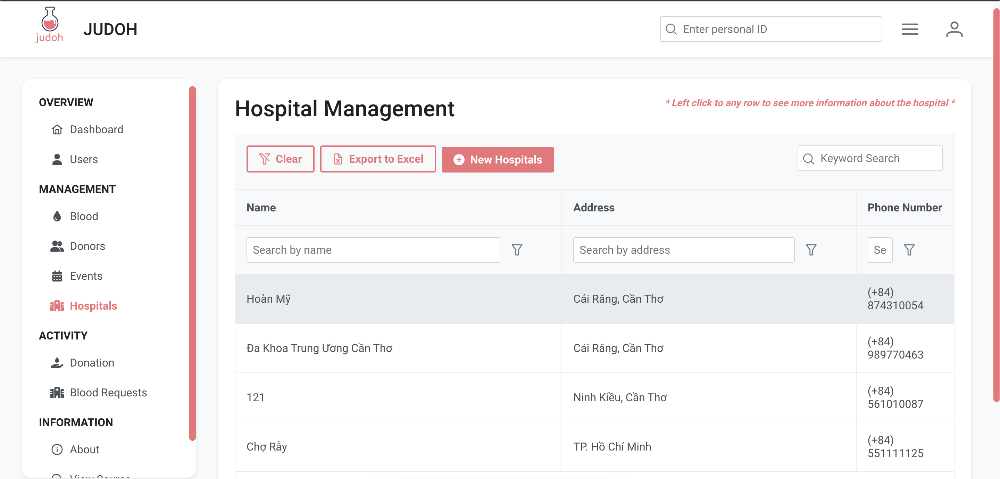
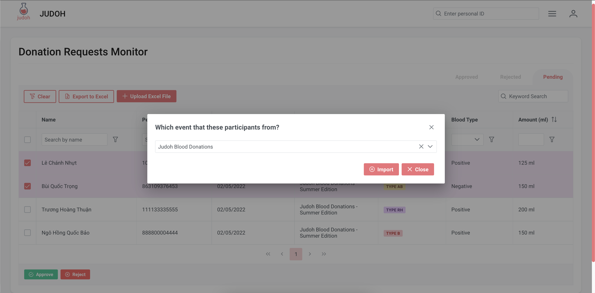

<div id="top"></div>

<!-- PROJECT LOGO -->
<br />
<div align="center">
  <a href="https://github.com/NgoQuocBao1010/Blood-Bank">
    
  </a>

  <h2 align="center">Judoh - Blood Bank Management System</h2>

  <p align="center">
    A management system provides basic functional features for a blood bank.
  </p>
</div>

<!-- ABOUT THE PROJECT -->

## About The Project

This project is a team project from my university. We intended to build a management system to manage a blood bank. Therefor, we provides 3 web applications for User (Landing Page), Hospital (hospital accounts) and Admins (Admin Page). We also implement other features such as organize/manage Blood Donation Events, ...

Here are some of the basis required feature:

-   ℹ️ Provide basic information about Blood for users (in landing page)
<P align="center"></p>

-   🕹 Manage blood storage (in admin page)
<P align="center"></p>

-   📃 Dashboard for admin to view important information (in admin page)
<P align="center"></p>

-   🩸 Create and Organize Blood Donation events (in admin page)
<P align="center"></p>

-   💉 Register for a blood donation events
<P align="center"></p>

-   More screenshots and features [here](#usage)

<p align="right">(<a href="#top">back to top</a>)</p>

### Built With

For front end

-   [Vue.js v3](https://vuejs.org/)
-   [PrimeVue](https://www.primefaces.org/primevue/) for UI library

For the backend API

-   [.NET](https://dotnet.microsoft.com/en-us/)
-   [ASP.NET](https://dotnet.microsoft.com/en-us/apps/aspnet)
-   [MongoDB](https://www.mongodb.com/)

<p align="right">(<a href="#top">back to top</a>)</p>

<!-- GETTING STARTED -->

## Getting Started

This is an example of how you may give instructions on setting up our project locally.
To get a local copy up and running follow these simple example steps.

#### Setting Up Environment

```
    Node.js >= v14.17.4
    NPM >= v6.14.14
    .NET v5.0
    MongoDB v5.0.5

    OS: Linux or MacOS
```

```markdown
    NOTES
    ⚠️ Please make sure that MongoDB and .NET are installed.
    ⚠️ Please re-install all the dependencies every time you test.
    ⚠️ Commands for this project are wrote for Linux-based OS. They may not work on Windows machines.
```

### Installation

1. Clone the repo and change directory to that folder

    ```sh
    git clone https://github.com/NgoQuocBao1010/Blood-Bank.git
    ```

1. Change directory to /backend, create an .env file and enter your localhost MongoDB URL

    ```text
    MongoDB=<Your Mongo DB URL>
    ```

1. Go back to the root folder, install all front-end dependencies

    ```bash
    npm run install-all
    ```

1. Build and serve the websites

    ```bash
    npm start
    ```

1. If everything works correctly, you could visit the website on http://127.0.0.1:5000 .

   **If there is any error (or for debug/development purpose)**, you can run the project by follow the below steps.

    - [Start server](./backend/README.md)
    - [Start landing page](./landing-page/README.md)
    - [Start admin page](./admin-page/README.md)

<p align="right">(<a href="#top">back to top</a>)</p>

<!-- USAGE EXAMPLES -->
<div id="Usage"></div>
<br/>

## Usage

As the introduction indicated, the main purpose of this project is for blood bank management, after the installation successfully, you can explore around our web application to enjoy all of its functionalities.

1. Landing Pages: Provide basic information of blood and the important of blood donation. Display and provide for users a way to register for blood donation events.

-   <details>
         <summary> <b>Landing page Screenshots</b></summary>
         <ol>
          <li>
              <p>
              Learn about blood
              </p>
              <p align="center"></p>
          </li>
          <li>
              <p>
              Learn about blood donation
              </p>
              <p align="center"></p>
          </li>
          <li>
              <p>
              Research information on Blood Donation events
              </p>
              <p align="center"></p>
          </li>
          <li>
              <p>
              Research information on Blood Donation events
              </p>
              <p align="center"></p>
          </li>
          <li>
              <p>
              Register for upcoming blood donation events
              </p>
              <p align="center"></p>
          </li>
         </ol>
     </details>

2. Admin Pages: Provide a way for administrators to manage Blood, blood incomes/outcomes, events, users, hospitals ... .

-   <details>
         <summary> <b>Admin page Screenshots</b> </summary>
         <ol>
          <li>
              <p>
              Dashboard - Provides brief and recent information
              </p>
              <p align="center"></p>
          </li>
          <li>
              <p>
              Blood Storage - Monitor the amount of each blood type from storage
              </p>
              <p align="center"></p>
          </li>
          <li>
              <p>
              Donors Management - Manage information of donors
              </p>
              <p align="center"></p>
              <p align="center"></p>
          </li>
          <li>
              <p>
              Events Management - Manage information of each blood donation event
              </p>
              <p align="center"></p>
              <p align="center"></p>
          </li>
          <li>
              <p>
              Users Management - Manage information and permission of each user, provide accounts for new users
              </p>
              <p align="center"></p>
          </li>
          <li>
              <p>
              Hospitals Management - Manage information 
              </p>
              <p align="center"></p>
          </li>
          <li>
              <p>
              Donation Management - Manage each donations from a blood donation events. Suppose each donations from an event will be captured in an Excel file, user can upload a excel file to save the donation info. (<a href="./data/sample_event_participants.xlsx">Here a sample excel file</a>)
              </p>
              <p align="center"></p>
              <p align="center"></p>
              <p align="center"></p>
          </li>
          <li>
              <p>
              Requests Management - Manage each blood request from a hospital. (<a href="#bloodRequests">Here a screenshots of hospital blood requests form.</a>)
              </p>
              <p align="center"></p>
          </li>
         </ol>
     </details>

3. Hospital Pages: Provide a way for hospital to requests blood from the bank.

-   <details>
         <summary> <b>Hospital Pages Screenshots</b> </summary>
         <ol>
          <div id="bloodRequests"></div>
          <li>
              <p>
              Blood Request Form - Request blood from the bank
              </p>
              <p align="center"></p>
          </li>
          <li>
              <p>
              Update information of hospital
              </p>
              <p align="center"></p>
          </li>
         </ol>
     </details>

<p align="right">(<a href="#top">back to top</a>)</p>

<!-- CONTRIBUTING -->

## Contributing

Contributions are what make the open source community such an amazing place to learn, inspire, and create. Any contributions you make are **greatly appreciated**.

If you have a suggestion that would make this better, please fork the repo and create a pull request. You can also simply open an issue with the tag "enhancement".
Don't forget to give the project a star! Thanks again!

1. Fork the Project
2. Create your Feature Branch (`git checkout -b feature/AmazingFeature`)
3. Commit your Changes (`git commit -m 'Add some AmazingFeature'`)
4. Push to the Branch (`git push origin feature/AmazingFeature`)
5. Open a Pull Request

<p align="right">(<a href="#top">back to top</a>)</p>

<!-- LICENSE -->

## License

Distributed under the MIT License.

<p align="right">(<a href="#top">back to top</a>)</p>

<!-- CONTACT -->

## Contributors

Trương Hoàng Thuận (Captain 💕) - [@truonghoangthuan](https://github.com/truonghoangthuan)

Ngô Hồng Quốc Bảo - [@NgoQuocBao](https://twitter.com/ngohquocbao1010)

Lê Chánh Nhựt - [@lcnhut070200](https://github.com/lcnhut070200)

Bùi Quốc Trọng - [@trongbui1105](https://github.com/trongbui1105)


<p align="right">(<a href="#top">back to top</a>)</p>

<!-- ACKNOWLEDGMENTS -->

## Acknowledgments

-   This awesome README temaplate is from [Best README Template](https://github.com/othneildrew/Best-README-Template). ♥
-   Admin pages UI are inspired from [Sakai Prime Vue](https://www.primefaces.org/sakai-vue/#/).

<p align="right">(<a href="#top">back to top</a>)</p>
